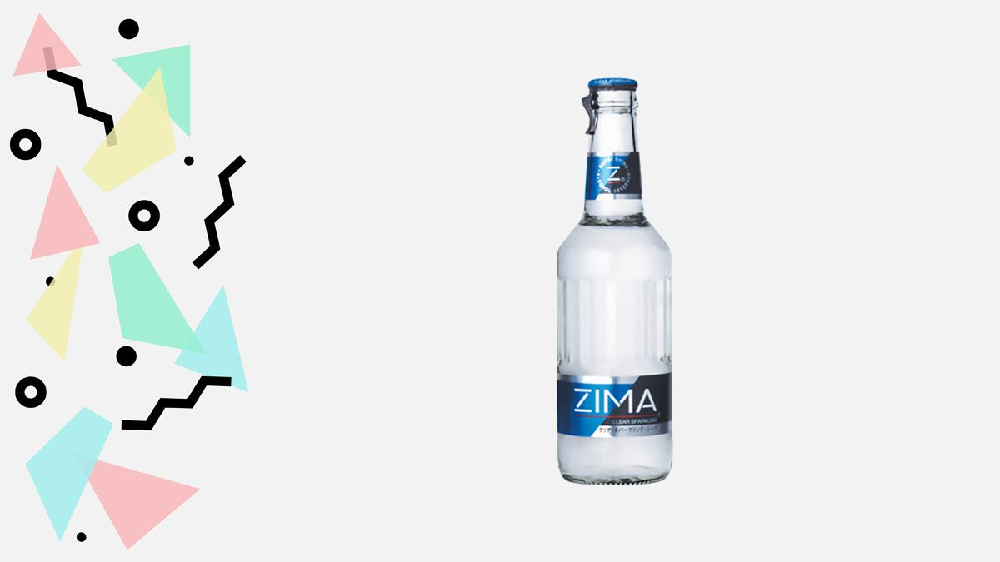

# gosaliya_sahil_brand_refresh_fip
 Brand refresh project [Final Integrated Project]

# description
This is a brand refresh website for an alchoholic beverage ZIMA. It is originated from 1998 but rebranded in 2019 on people's choice.
It is made with html, css and javascript.
It goes from its background story to modern day things. 

# version / history
1.0 - layout with grid system and on-go images
2.0 - fixed issues, implemented functionalities and media along with information
3.0 - responsive for mobile, tablet and desktop

# how to use
1. Clone the repo / Download the files
2. Load it in your system
3. Run it and have fun

# functionality
Use your mouse or touch pad as it is responsive website and explore brand.

# contributing
Sahilkumar Gosaliya - Student at Fanshawe

# license
MIT
